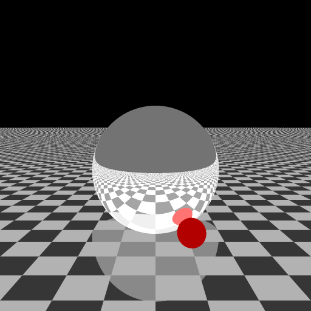

### Hey ho!

A ray-tracer written entirely in python with entirely no other dependencies.

Actually, it's deploying *sphere-tracing*, or *ray-marching* as it's
called in the [shadertoy](https://www.shadertoy.com/) community, where
a *signed distance field* is calculated for the whole scene and the ray
does incremental steps to reach a surface. 

I'm running this with [pypy](https://www.pypy.org/) and it's still super
slow. Above image (512²) took 3 minutes or so. 

Probably a lot of bugs are lurking in the corners and not rendered with 
fancy glow or anything...
